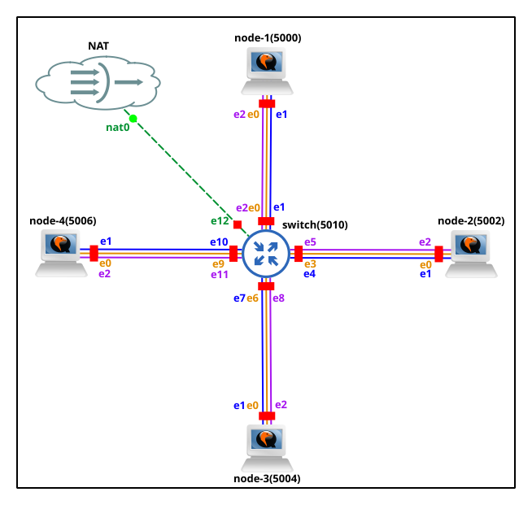

# Lab 2 - VLAN

## Initial GNS3 configuration




## Nodes Setup

Interfaces on the nodes were named as follows: `ethN_XY`, where `N` is the interface number and `XY` is the name of the link between the two nodes that this interface connects to. `eth0` on each node was left untouched (used for management, configured via DHCP).

Static IP addresses were then assigned to each interface except `eth0`. To make them persistent, they were written to `/etc/network/interfaces`.

For instance, content of the `/etc/network/interfaces` for node-1:

```text
auto lo
iface lo inet loopback

auto eth0
iface eth0 inet dhcp

auto eth1_13
iface eth1_13 inet static
    address 10.0.13.1
    netmask 255.255.255.252

auto eth2_14
iface eth2_14 inet static
    address 10.0.14.1
    netmask 255.255.255.252
```

The 3rd octet of each address corresponds to the link between two nodes (`13`, `14`, `23`, `24`). The last octet identifies the node on that link: `1` for node-1/node-2, `2` for node-3/node-4.

| Node | Interface | MAC address | IP address | Netmask | Connected to |
|------|-----------|-------------|------------|---------|--------------|
| node-1 | eth0 | 0c:3e:96:80:00:00 | DHCP | - | management |
| node-1 | eth1_13 | 0c:3e:96:80:00:01 | 10.0.13.1 | 255.255.255.252 | node-3 |
| node-1 | eth2_14 | 0c:3e:96:80:00:02 | 10.0.14.1 | 255.255.255.252 | node-4 |
| node-2 | eth0 | 0c:d7:44:9c:00:00 | DHCP | - | management |
| node-2 | eth1_23 | 0c:d7:44:9c:00:01 | 10.0.23.1 | 255.255.255.252 | node-3 |
| node-2 | eth2_24 | 0c:d7:44:9c:00:02 | 10.0.24.1 | 255.255.255.252 | node-4 |
| node-3 | eth0 | 0c:5a:73:85:00:00 | DHCP | - | management |
| node-3 | eth1_13 | 0c:5a:73:85:00:01 | 10.0.13.2 | 255.255.255.252 | node-1 |
| node-3 | eth2_23 | 0c:5a:73:85:00:02 | 10.0.23.2 | 255.255.255.252 | node-2 |
| node-4 | eth0 | 0c:08:8c:fb:00:00 | DHCP | - | management |
| node-4 | eth1_14 | 0c:08:8c:fb:00:01 | 10.0.14.2 | 255.255.255.252 | node-1 |
| node-4 | eth2_24 | 0c:08:8c:fb:00:02 | 10.0.24.2 | 255.255.255.252 | node-2 |

Additionally, `arp_ignore` was set to `1` on every interface of every node. By default (`0`) Linux answers an ARP request for any locally configured address regardless of which interface the request arrived on, so a node would reply for its own address on another VLAN. With `1` an interface only answers for addresses configured on that same interface. This is needed to avoid creating false positive results during the isolation proof.

For instance command for node-1:

```bash
root@node-1:~$ sysctl -w net.ipv4.conf.all.arp_ignore=1 && sysctl -w net.ipv4.conf.eth1_13.arp_ignore=1 && sysctl -w net.ipv4.conf.eth2_14.arp_ignore=1
```

To make it persistent:

```bash
root@node-1:~$ cat >> /etc/sysctl.conf <<'EOF'
net.ipv4.conf.all.arp_ignore=1
net.ipv4.conf.eth1_13.arp_ignore=1
net.ipv4.conf.eth2_14.arp_ignore=1
EOF
```

*Same commands but with other interfaces were run for the other nodes too.*

## VLAN Setup on the Switch

Add bridge:
```bash
root@switch:~$ ip l add name br1 type bridge
```

Enable `vlan_filtering`:
```bash
root@switch:~$ ip l set dev br1 type bridge vlan_filtering 1
```

Add all ports to the bridge and set them up:
```bash
root@switch:~$ for i in $(seq 0 12); do ip l set dev eth$i master br1 && ip l set eth$i up; done
```

Set bridge `br1` up:
```bash
root@switch:~$ ip l set br1 up
```

Add VLANs to which nodes are connected (via other interface than `eth0`):
```bash
root@switch:~$ bridge vlan add vid 13 dev eth1 pvid untagged
root@switch:~$ bridge vlan add vid 14 dev eth2 pvid untagged
root@switch:~$ bridge vlan add vid 23 dev eth4 pvid untagged
root@switch:~$ bridge vlan add vid 24 dev eth5 pvid untagged
root@switch:~$ bridge vlan add vid 13 dev eth7 pvid untagged
root@switch:~$ bridge vlan add vid 23 dev eth8 pvid untagged
root@switch:~$ bridge vlan add vid 14 dev eth10 pvid untagged
root@switch:~$ bridge vlan add vid 24 dev eth11 pvid untagged
```

Delete default `vid 1` from the ports above:
```bash
for i in 1 2 4 5 7 8 10 11; do bridge vlan del vid 1 dev eth$i; done
```

Verify result:
```bash
root@switch:~$ ip l
1: lo: <LOOPBACK,UP,LOWER_UP> mtu 65536 qdisc noqueue state UNKNOWN mode DEFAULT group default qlen 1000
    link/loopback 00:00:00:00:00:00 brd 00:00:00:00:00:00
2: eth0: <BROADCAST,MULTICAST,UP,LOWER_UP> mtu 1500 qdisc pfifo_fast master br1 state UP mode DEFAULT group default qlen 1000
    link/ether 0c:cb:45:60:00:00 brd ff:ff:ff:ff:ff:ff
3: eth1: <BROADCAST,MULTICAST,UP,LOWER_UP> mtu 1500 qdisc pfifo_fast master br1 state UP mode DEFAULT group default qlen 1000
    link/ether 0c:cb:45:60:00:01 brd ff:ff:ff:ff:ff:ff
4: eth2: <BROADCAST,MULTICAST,UP,LOWER_UP> mtu 1500 qdisc pfifo_fast master br1 state UP mode DEFAULT group default qlen 1000
    link/ether 0c:cb:45:60:00:02 brd ff:ff:ff:ff:ff:ff
5: eth3: <BROADCAST,MULTICAST,UP,LOWER_UP> mtu 1500 qdisc pfifo_fast master br1 state UP mode DEFAULT group default qlen 1000
    link/ether 0c:cb:45:60:00:03 brd ff:ff:ff:ff:ff:ff
6: eth4: <BROADCAST,MULTICAST,UP,LOWER_UP> mtu 1500 qdisc pfifo_fast master br1 state UP mode DEFAULT group default qlen 1000
    link/ether 0c:cb:45:60:00:04 brd ff:ff:ff:ff:ff:ff
7: eth5: <BROADCAST,MULTICAST,UP,LOWER_UP> mtu 1500 qdisc pfifo_fast master br1 state UP mode DEFAULT group default qlen 1000
    link/ether 0c:cb:45:60:00:05 brd ff:ff:ff:ff:ff:ff
8: eth6: <BROADCAST,MULTICAST,UP,LOWER_UP> mtu 1500 qdisc pfifo_fast master br1 state UP mode DEFAULT group default qlen 1000
    link/ether 0c:cb:45:60:00:06 brd ff:ff:ff:ff:ff:ff
9: eth7: <BROADCAST,MULTICAST,UP,LOWER_UP> mtu 1500 qdisc pfifo_fast master br1 state UP mode DEFAULT group default qlen 1000
    link/ether 0c:cb:45:60:00:07 brd ff:ff:ff:ff:ff:ff
10: eth8: <BROADCAST,MULTICAST,UP,LOWER_UP> mtu 1500 qdisc pfifo_fast master br1 state UP mode DEFAULT group default qlen 1000
    link/ether 0c:cb:45:60:00:08 brd ff:ff:ff:ff:ff:ff
11: eth9: <BROADCAST,MULTICAST,UP,LOWER_UP> mtu 1500 qdisc pfifo_fast master br1 state UP mode DEFAULT group default qlen 1000
    link/ether 0c:cb:45:60:00:09 brd ff:ff:ff:ff:ff:ff
12: eth10: <BROADCAST,MULTICAST,UP,LOWER_UP> mtu 1500 qdisc pfifo_fast master br1 state UP mode DEFAULT group default qlen 1000
    link/ether 0c:cb:45:60:00:0a brd ff:ff:ff:ff:ff:ff
13: eth11: <BROADCAST,MULTICAST,UP,LOWER_UP> mtu 1500 qdisc pfifo_fast master br1 state UP mode DEFAULT group default qlen 1000
    link/ether 0c:cb:45:60:00:0b brd ff:ff:ff:ff:ff:ff
14: eth12: <BROADCAST,MULTICAST,UP,LOWER_UP> mtu 1500 qdisc pfifo_fast master br1 state UP mode DEFAULT group default qlen 1000
    link/ether 0c:cb:45:60:00:0c brd ff:ff:ff:ff:ff:ff
15: br1: <BROADCAST,MULTICAST,UP,LOWER_UP> mtu 1500 qdisc noqueue state UP mode DEFAULT group default qlen 1000
    link/ether 0c:cb:45:60:00:00 brd ff:ff:ff:ff:ff:ff

root@switch:~$ bridge vlan show
port              vlan-id  
eth0              1 PVID Egress Untagged
eth1              13 PVID Egress Untagged
eth2              14 PVID Egress Untagged
eth3              1 PVID Egress Untagged
eth4              23 PVID Egress Untagged
eth5              24 PVID Egress Untagged
eth6              1 PVID Egress Untagged
eth7              13 PVID Egress Untagged
eth8              23 PVID Egress Untagged
eth9              1 PVID Egress Untagged
eth10             14 PVID Egress Untagged
eth11             24 PVID Egress Untagged
eth12             1 PVID Egress Untagged
br1               1 PVID Egress Untagged
```

`ip l` confirms all ports (`eth0`-`eth12`) are enslaved to `br1` and up, and `bridge vlan show` confirms each node-facing port has the correct VLAN as its untagged PVID with the default `vid 1` removed.

To make these changes survive a reboot, the bridge setup was written to `/etc/network/interfaces`.

Content of the `/etc/network/interfaces`:
```text
auto lo
iface lo inet loopback

auto br1
iface br1 inet dhcp
    bridge_ports eth0 eth1 eth2 eth3 eth4 eth5 eth6 eth7 eth8 eth9 eth10 eth11 eth12
    up ip link set dev br1 type bridge vlan_filtering 1
    up bridge vlan add vid 13 dev eth1 pvid untagged
    up bridge vlan del vid 1 dev eth1
    up bridge vlan add vid 14 dev eth2 pvid untagged
    up bridge vlan del vid 1 dev eth2
    up bridge vlan add vid 23 dev eth4 pvid untagged
    up bridge vlan del vid 1 dev eth4
    up bridge vlan add vid 24 dev eth5 pvid untagged
    up bridge vlan del vid 1 dev eth5
    up bridge vlan add vid 13 dev eth7 pvid untagged
    up bridge vlan del vid 1 dev eth7
    up bridge vlan add vid 23 dev eth8 pvid untagged
    up bridge vlan del vid 1 dev eth8
    up bridge vlan add vid 14 dev eth10 pvid untagged
    up bridge vlan del vid 1 dev eth10
    up bridge vlan add vid 24 dev eth11 pvid untagged
    up bridge vlan del vid 1 dev eth11
```

Additionally the source of the ip address of the bridge was set to the DHCP to get access to the internet on the switch.

## Nodes Getting IPs Over VLAN 1

Since in the `/etc/network/interfaces` the source of ip for `eth0` is set to the DHCP by default they will get ip from the host over the NAT. 

Below is the check of the ips:

For node-1:
```bash
root@node-1:~$ ip -br a show eth0
eth0             UP             192.168.122.231/24 fe80::e3e:96ff:fe80:0/64 
```

For node-2:
```bash
root@node-2:~$ ip -br a show eth0
eth0             UP             192.168.122.47/24 fe80::ed7:44ff:fe9c:0/64 
```

For node-3:
```bash
root@node-3:~$ ip -br a show eth0
eth0             UP             192.168.122.163/24 fe80::e5a:73ff:fe85:0/64 
```

For node-4:
```bash
root@node-4:~$ ip -br a show eth0
eth0             UP             192.168.122.38/24 fe80::e08:8cff:fefb:0/64 
```

## Connectivity Proof

To prove connectivity for each link between nodes, I ran `ping` on one node and `tcpdump` on the other. If `ping` shows 0% packet loss and `tcpdump` shows the ICMP packets arriving, the link is healthy. It also proves connectivity in two directions since `ping` requires sending and then receiving the response.

### Node 1 <-> Node 3 Connectivity

`ping` on the node-1:
```bash
root@node-1:~$ ping -c 5 -I eth1_13 10.0.13.2
PING 10.0.13.2 (10.0.13.2): 56 data bytes
64 bytes from 10.0.13.2: seq=0 ttl=64 time=1.755 ms
64 bytes from 10.0.13.2: seq=1 ttl=64 time=1.825 ms
64 bytes from 10.0.13.2: seq=2 ttl=64 time=1.868 ms
64 bytes from 10.0.13.2: seq=3 ttl=64 time=1.817 ms
64 bytes from 10.0.13.2: seq=4 ttl=64 time=1.916 ms

--- 10.0.13.2 ping statistics ---
5 packets transmitted, 5 packets received, 0% packet loss
round-trip min/avg/max = 1.755/1.836/1.916 ms
```

`tcpdump` on the node-3:
```bash
root@node-3:~$ tcpdump -i eth1_13 icmp
tcpdump: verbose output suppressed, use -v[v]... for full protocol decode
listening on eth1_13, link-type EN10MB (Ethernet), snapshot length 262144 bytes
21:51:10.597411 IP 10.0.13.1 > 10.0.13.2: ICMP echo request, id 2507, seq 0, length 64
21:51:10.597482 IP 10.0.13.2 > 10.0.13.1: ICMP echo reply, id 2507, seq 0, length 64
21:51:11.597788 IP 10.0.13.1 > 10.0.13.2: ICMP echo request, id 2507, seq 1, length 64
21:51:11.597853 IP 10.0.13.2 > 10.0.13.1: ICMP echo reply, id 2507, seq 1, length 64
21:51:12.598189 IP 10.0.13.1 > 10.0.13.2: ICMP echo request, id 2507, seq 2, length 64
21:51:12.598255 IP 10.0.13.2 > 10.0.13.1: ICMP echo reply, id 2507, seq 2, length 64
21:51:13.598444 IP 10.0.13.1 > 10.0.13.2: ICMP echo request, id 2507, seq 3, length 64
21:51:13.598493 IP 10.0.13.2 > 10.0.13.1: ICMP echo reply, id 2507, seq 3, length 64
21:51:14.599236 IP 10.0.13.1 > 10.0.13.2: ICMP echo request, id 2507, seq 4, length 64
21:51:14.599305 IP 10.0.13.2 > 10.0.13.1: ICMP echo reply, id 2507, seq 4, length 64
^C
10 packets captured
10 packets received by filter
0 packets dropped by kernel
```

### Node 1 <-> Node 4 Connectivity

`ping` on the node-1:
```bash
root@node-1:~$ ping -c 5 -I eth2_14 10.0.14.2
PING 10.0.14.2 (10.0.14.2): 56 data bytes
64 bytes from 10.0.14.2: seq=0 ttl=64 time=4.969 ms
64 bytes from 10.0.14.2: seq=1 ttl=64 time=1.954 ms
64 bytes from 10.0.14.2: seq=2 ttl=64 time=2.288 ms
64 bytes from 10.0.14.2: seq=3 ttl=64 time=1.756 ms
64 bytes from 10.0.14.2: seq=4 ttl=64 time=2.122 ms

--- 10.0.14.2 ping statistics ---
5 packets transmitted, 5 packets received, 0% packet loss
round-trip min/avg/max = 1.756/2.617/4.969 ms
```

`tcpdump` on the node-4:
```bash
root@node-4:~$ tcpdump -i eth1_14 icmp
tcpdump: verbose output suppressed, use -v[v]... for full protocol decode
listening on eth1_14, link-type EN10MB (Ethernet), snapshot length 262144 bytes
21:54:48.239064 IP 10.0.14.1 > 10.0.14.2: ICMP echo request, id 2519, seq 0, length 64
21:54:48.239127 IP 10.0.14.2 > 10.0.14.1: ICMP echo reply, id 2519, seq 0, length 64
21:54:49.236362 IP 10.0.14.1 > 10.0.14.2: ICMP echo request, id 2519, seq 1, length 64
21:54:49.236455 IP 10.0.14.2 > 10.0.14.1: ICMP echo reply, id 2519, seq 1, length 64
21:54:50.237003 IP 10.0.14.1 > 10.0.14.2: ICMP echo request, id 2519, seq 2, length 64
21:54:50.237210 IP 10.0.14.2 > 10.0.14.1: ICMP echo reply, id 2519, seq 2, length 64
21:54:51.237232 IP 10.0.14.1 > 10.0.14.2: ICMP echo request, id 2519, seq 3, length 64
21:54:51.237313 IP 10.0.14.2 > 10.0.14.1: ICMP echo reply, id 2519, seq 3, length 64
21:54:52.237999 IP 10.0.14.1 > 10.0.14.2: ICMP echo request, id 2519, seq 4, length 64
21:54:52.238073 IP 10.0.14.2 > 10.0.14.1: ICMP echo reply, id 2519, seq 4, length 64
^C
10 packets captured
10 packets received by filter
0 packets dropped by kernel
```

### Node 2 <-> Node 3 Connectivity

`ping` on the node-2:
```bash
root@node-2:~$ ping -c 5 -I eth1_23 10.0.23.2
PING 10.0.23.2 (10.0.23.2): 56 data bytes
64 bytes from 10.0.23.2: seq=0 ttl=64 time=1.886 ms
64 bytes from 10.0.23.2: seq=1 ttl=64 time=1.840 ms
64 bytes from 10.0.23.2: seq=2 ttl=64 time=2.354 ms
64 bytes from 10.0.23.2: seq=3 ttl=64 time=2.436 ms
64 bytes from 10.0.23.2: seq=4 ttl=64 time=2.124 ms

--- 10.0.23.2 ping statistics ---
5 packets transmitted, 5 packets received, 0% packet loss
round-trip min/avg/max = 1.840/2.128/2.436 ms
```

`tcpdump` on the node-3:
```bash
root@node-3:~$ tcpdump -i eth2_23 icmp
tcpdump: verbose output suppressed, use -v[v]... for full protocol decode
listening on eth2_23, link-type EN10MB (Ethernet), snapshot length 262144 bytes
21:51:58.196844 IP 10.0.23.1 > 10.0.23.2: ICMP echo request, id 2515, seq 0, length 64
21:51:58.196922 IP 10.0.23.2 > 10.0.23.1: ICMP echo reply, id 2515, seq 0, length 64
21:51:59.197397 IP 10.0.23.1 > 10.0.23.2: ICMP echo request, id 2515, seq 1, length 64
21:51:59.197467 IP 10.0.23.2 > 10.0.23.1: ICMP echo reply, id 2515, seq 1, length 64
21:52:00.198139 IP 10.0.23.1 > 10.0.23.2: ICMP echo request, id 2515, seq 2, length 64
21:52:00.198213 IP 10.0.23.2 > 10.0.23.1: ICMP echo reply, id 2515, seq 2, length 64
21:52:01.199007 IP 10.0.23.1 > 10.0.23.2: ICMP echo request, id 2515, seq 3, length 64
21:52:01.199133 IP 10.0.23.2 > 10.0.23.1: ICMP echo reply, id 2515, seq 3, length 64
21:52:02.199477 IP 10.0.23.1 > 10.0.23.2: ICMP echo request, id 2515, seq 4, length 64
21:52:02.199505 IP 10.0.23.2 > 10.0.23.1: ICMP echo reply, id 2515, seq 4, length 64
^C
10 packets captured
10 packets received by filter
0 packets dropped by kernel
```

### Node 2 <-> Node 4 Connectivity

`ping` on the node-2:
```bash
root@node-2:~$ ping -c 5 -I eth2_24 10.0.24.2
PING 10.0.24.2 (10.0.24.2): 56 data bytes
64 bytes from 10.0.24.2: seq=0 ttl=64 time=7.144 ms
64 bytes from 10.0.24.2: seq=1 ttl=64 time=1.608 ms
64 bytes from 10.0.24.2: seq=2 ttl=64 time=1.867 ms
64 bytes from 10.0.24.2: seq=3 ttl=64 time=1.668 ms
64 bytes from 10.0.24.2: seq=4 ttl=64 time=1.957 ms

--- 10.0.24.2 ping statistics ---
5 packets transmitted, 5 packets received, 0% packet loss
round-trip min/avg/max = 1.608/2.848/7.144 ms
```

`tcpdump` on the node-4:
```bash
root@node-4:~$ tcpdump -i eth2_24 icmp
tcpdump: verbose output suppressed, use -v[v]... for full protocol decode
listening on eth2_24, link-type EN10MB (Ethernet), snapshot length 262144 bytes
22:01:29.623613 IP 10.0.24.1 > 10.0.24.2: ICMP echo request, id 2528, seq 0, length 64
22:01:29.623676 IP 10.0.24.2 > 10.0.24.1: ICMP echo reply, id 2528, seq 0, length 64
22:01:30.618818 IP 10.0.24.1 > 10.0.24.2: ICMP echo request, id 2528, seq 1, length 64
22:01:30.618890 IP 10.0.24.2 > 10.0.24.1: ICMP echo reply, id 2528, seq 1, length 64
22:01:31.619397 IP 10.0.24.1 > 10.0.24.2: ICMP echo request, id 2528, seq 2, length 64
22:01:31.619487 IP 10.0.24.2 > 10.0.24.1: ICMP echo reply, id 2528, seq 2, length 64
22:01:32.619751 IP 10.0.24.1 > 10.0.24.2: ICMP echo request, id 2528, seq 3, length 64
22:01:32.619800 IP 10.0.24.2 > 10.0.24.1: ICMP echo reply, id 2528, seq 3, length 64
22:01:33.620247 IP 10.0.24.1 > 10.0.24.2: ICMP echo request, id 2528, seq 4, length 64
22:01:33.620335 IP 10.0.24.2 > 10.0.24.1: ICMP echo reply, id 2528, seq 4, length 64
^C
10 packets captured
10 packets received by filter
0 packets dropped by kernel
```


## Isolation Proof

### Ping Check

`ping` on the IP addresses of interfaces on other VLANs fails with 100% packet loss:

`ping` from the node-1 interface `eth1_13` (vlan 13) to addresses on vlan 14, 23 and 24:
```bash
root@node-1:~$ ping -c 5 -I eth1_13 10.0.14.1
PING 10.0.14.1 (10.0.14.1): 56 data bytes

--- 10.0.14.1 ping statistics ---
5 packets transmitted, 0 packets received, 100% packet loss
root@node-1:~$ ping -c 5 -I eth1_13 10.0.23.1
PING 10.0.23.1 (10.0.23.1): 56 data bytes

--- 10.0.23.1 ping statistics ---
5 packets transmitted, 0 packets received, 100% packet loss
root@node-1:~$ ping -c 5 -I eth1_13 10.0.24.1
PING 10.0.24.1 (10.0.24.1): 56 data bytes

--- 10.0.24.1 ping statistics ---
5 packets transmitted, 0 packets received, 100% packet loss
```

The same check was carried out from an interface on each of the remaining VLANs (14, 23 and 24) towards the addresses of the other three VLANs. Every attempt ended with 100% packet loss. The output of those runs is omitted here to avoid repeating near-identical listings.

### ARP Broadcast Isolation

`arping` broadcasts on one VLAN are not seen on the other VLANs.

`arping` on the node-1 interface `eth1_13` (vlan 13):
```bash
root@node-1:~$ arping -c 5 -I eth1_13 10.0.13.2
ARPING 10.0.13.2 from 10.0.13.1 eth1_13
Unicast reply from 10.0.13.2 [0c:5a:73:85:00:01] 1.701ms
Unicast reply from 10.0.13.2 [0c:5a:73:85:00:01] 2.182ms
Unicast reply from 10.0.13.2 [0c:5a:73:85:00:01] 1.473ms
Unicast reply from 10.0.13.2 [0c:5a:73:85:00:01] 1.496ms
Unicast reply from 10.0.13.2 [0c:5a:73:85:00:01] 2.032ms
Sent 5 probe(s) (0 broadcast(s))
Received 5 response(s) (0 request(s), 0 broadcast(s))
```

The broadcast is confirmed to have gone out, since node-3's interface `eth1_13` (on the same vlan 13) replies to it. But nothing arrives on the other VLANs:

```bash
root@node-3:~$ tcpdump -n -e -i eth1_13 arp
tcpdump: verbose output suppressed, use -v[v]... for full protocol decode
listening on eth1_13, link-type EN10MB (Ethernet), snapshot length 262144 bytes
12:34:54.532380 0c:3e:96:80:00:01 > ff:ff:ff:ff:ff:ff, ethertype ARP (0x0806), length 60: Request who-has 10.0.13.2 (ff:ff:ff:ff:ff:ff) tell 10.0.13.1, length 46
12:34:54.532431 0c:5a:73:85:00:01 > 0c:3e:96:80:00:01, ethertype ARP (0x0806), length 42: Reply 10.0.13.2 is-at 0c:5a:73:85:00:01, length 28
12:34:55.532747 0c:3e:96:80:00:01 > 0c:5a:73:85:00:01, ethertype ARP (0x0806), length 60: Request who-has 10.0.13.2 (0c:5a:73:85:00:01) tell 10.0.13.1, length 46
12:34:55.532799 0c:5a:73:85:00:01 > 0c:3e:96:80:00:01, ethertype ARP (0x0806), length 42: Reply 10.0.13.2 is-at 0c:5a:73:85:00:01, length 28
12:34:56.533108 0c:3e:96:80:00:01 > 0c:5a:73:85:00:01, ethertype ARP (0x0806), length 60: Request who-has 10.0.13.2 (0c:5a:73:85:00:01) tell 10.0.13.1, length 46
12:34:56.533147 0c:5a:73:85:00:01 > 0c:3e:96:80:00:01, ethertype ARP (0x0806), length 42: Reply 10.0.13.2 is-at 0c:5a:73:85:00:01, length 28
12:34:57.533689 0c:3e:96:80:00:01 > 0c:5a:73:85:00:01, ethertype ARP (0x0806), length 60: Request who-has 10.0.13.2 (0c:5a:73:85:00:01) tell 10.0.13.1, length 46
12:34:57.533728 0c:5a:73:85:00:01 > 0c:3e:96:80:00:01, ethertype ARP (0x0806), length 42: Reply 10.0.13.2 is-at 0c:5a:73:85:00:01, length 28
12:34:58.534416 0c:3e:96:80:00:01 > 0c:5a:73:85:00:01, ethertype ARP (0x0806), length 60: Request who-has 10.0.13.2 (0c:5a:73:85:00:01) tell 10.0.13.1, length 46
12:34:58.534469 0c:5a:73:85:00:01 > 0c:3e:96:80:00:01, ethertype ARP (0x0806), length 42: Reply 10.0.13.2 is-at 0c:5a:73:85:00:01, length 28
^C
10 packets captured
10 packets received by filter
0 packets dropped by kernel
```

`tcpdump` on the node-2 interface `eth2_24` (vlan 24):
```bash
root@node-2:~$ tcpdump -n -e -i eth2_24 arp
tcpdump: verbose output suppressed, use -v[v]... for full protocol decode
listening on eth2_24, link-type EN10MB (Ethernet), snapshot length 262144 bytes
^C
0 packets captured
0 packets received by filter
0 packets dropped by kernel
```

`tcpdump` on the node-3 interface `eth2_23` (vlan 23):
```bash
root@node-3:~$ tcpdump -n -e -i eth2_23 arp
tcpdump: verbose output suppressed, use -v[v]... for full protocol decode
listening on eth2_23, link-type EN10MB (Ethernet), snapshot length 262144 bytes
^C
0 packets captured
0 packets received by filter
0 packets dropped by kernel
```

`tcpdump` on the node-4 interface `eth1_14` (vlan 14):
```bash
root@node-4:~$ tcpdump -n -e -i eth1_14 arp
tcpdump: verbose output suppressed, use -v[v]... for full protocol decode
listening on eth1_14, link-type EN10MB (Ethernet), snapshot length 262144 bytes
^C
0 packets captured
0 packets received by filter
0 packets dropped by kernel
```

No ARP packets were captured on any interface belonging to a different VLAN than the one the broadcast was sent on. The same check was carried out with the broadcast originating on each of the remaining VLANs (14, 23 and 24) while capturing on interfaces of the other three. No ARP packets were captured in any of those runs either. Their output is omitted here to avoid repeating near-identical listings.


## Addition of the Tagged Link

The link between the switch and the NAT node was turned into a trunk. VLAN 1 (management) stays untagged on this link so host connectivity is not broken, while VLANs 13, 14, 23 and 24 (the node-to-node data VLANs) are carried as tagged traffic.

### Switch Configuration

Add VLANs 13, 14, 23 and 24 as tagged members of `eth12`:
```bash
root@switch:~$ bridge vlan add vid 13 dev eth12
root@switch:~$ bridge vlan add vid 14 dev eth12
root@switch:~$ bridge vlan add vid 23 dev eth12
root@switch:~$ bridge vlan add vid 24 dev eth12
```

Verify: `eth12` now keeps `vid 1` as PVID/untagged and additionally carries `13`, `14`, `23`, `24` as tagged VLANs:
```bash
root@switch:~$ bridge vlan show
port              vlan-id  
eth0              1 PVID Egress Untagged
eth1              13 PVID Egress Untagged
eth2              14 PVID Egress Untagged
eth3              1 PVID Egress Untagged
eth4              23 PVID Egress Untagged
eth5              24 PVID Egress Untagged
eth6              1 PVID Egress Untagged
eth7              13 PVID Egress Untagged
eth8              23 PVID Egress Untagged
eth9              1 PVID Egress Untagged
eth10             14 PVID Egress Untagged
eth11             24 PVID Egress Untagged
eth12             1 PVID Egress Untagged
                  13
                  14
                  23
                  24
br1               1 PVID Egress Untagged
```

To make it persistent `/etc/network/interfaces` was updated:

```text
auto lo
iface lo inet loopback

auto br1
iface br1 inet dhcp
    bridge_ports eth0 eth1 eth2 eth3 eth4 eth5 eth6 eth7 eth8 eth9 eth10 eth11 eth12
    up ip link set dev br1 type bridge vlan_filtering 1
    up bridge vlan add vid 13 dev eth1 pvid untagged
    up bridge vlan del vid 1 dev eth1
    up bridge vlan add vid 14 dev eth2 pvid untagged
    up bridge vlan del vid 1 dev eth2
    up bridge vlan add vid 23 dev eth4 pvid untagged
    up bridge vlan del vid 1 dev eth4
    up bridge vlan add vid 24 dev eth5 pvid untagged
    up bridge vlan del vid 1 dev eth5
    up bridge vlan add vid 13 dev eth7 pvid untagged
    up bridge vlan del vid 1 dev eth7
    up bridge vlan add vid 23 dev eth8 pvid untagged
    up bridge vlan del vid 1 dev eth8
    up bridge vlan add vid 14 dev eth10 pvid untagged
    up bridge vlan del vid 1 dev eth10
    up bridge vlan add vid 24 dev eth11 pvid untagged
    up bridge vlan del vid 1 dev eth11
    up bridge vlan add vid 13 dev eth12
    up bridge vlan add vid 14 dev eth12
    up bridge vlan add vid 23 dev eth12
    up bridge vlan add vid 24 dev eth12
```

### Capturing Trunk Traffic

To prove each VLAN is actually tagged on the wire, `eth12` was captured to a file and then read back after generating traffic on each VLAN in turn:
```bash
root@switch:~$ tcpdump -n -e -U -i eth12 -w /root/trunk.pcap
```

To generate traffic on a given VLAN, `arping` was run from a node's interface on that VLAN, targeting the IP address of a node on a different VLAN. This is intentional: `arping` sends its first probe as a broadcast, then switches to unicast once a reply fills the ARP cache. Since the target is on another VLAN and never replies, no cache entry is ever created, so every probe stays a broadcast and gets flooded to all members of the source VLAN, including the trunk port.

#### VLAN 13

`arping` from node-1's `eth1_13` (vlan 13) to a vlan 14 address:
```bash
root@node-1:~$ arping -c 5 -I eth1_13 10.0.14.1
ARPING 10.0.14.1 from 10.0.13.1 eth1_13
Sent 5 probe(s) (0 broadcast(s))
Received 0 response(s) (0 request(s), 0 broadcast(s))
```

Traffic captured on `eth12`:
```bash
root@switch:~$ tcpdump -n -e -r /root/trunk.pcap 
reading from file /root/trunk.pcap, link-type EN10MB (Ethernet), snapshot length 262144
14:57:42.307756 2e:18:d2:20:52:65 > 01:80:c2:00:00:00, 802.3, length 38: LLC, dsap STP (0x42) Individual, ssap STP (0x42) Command, ctrl 0x03: STP 802.1d, Config, Flags [none], bridge-id 8000.52:54:00:cd:24:e1.8001, length 35
14:57:43.173947 0c:cb:45:60:00:00 > ff:ff:ff:ff:ff:ff, ethertype IPv4 (0x0800), length 342: 0.0.0.0.68 > 255.255.255.255.67: BOOTP/DHCP, Request from 0c:cb:45:60:00:00, length 300
14:57:43.176377 52:54:00:cd:24:e1 > 0c:cb:45:60:00:00, ethertype IPv4 (0x0800), length 342: 192.168.122.1.67 > 192.168.122.186.68: BOOTP/DHCP, Reply, length 300
14:57:43.180467 0c:3e:96:80:00:01 > ff:ff:ff:ff:ff:ff, ethertype 802.1Q (0x8100), length 64: vlan 13, p 0, ethertype ARP (0x0806), Request who-has 10.0.14.1 (ff:ff:ff:ff:ff:ff) tell 10.0.13.1, length 46
14:57:44.180981 0c:3e:96:80:00:01 > ff:ff:ff:ff:ff:ff, ethertype 802.1Q (0x8100), length 64: vlan 13, p 0, ethertype ARP (0x0806), Request who-has 10.0.14.1 (ff:ff:ff:ff:ff:ff) tell 10.0.13.1, length 46
14:57:44.292634 2e:18:d2:20:52:65 > 01:80:c2:00:00:00, 802.3, length 38: LLC, dsap STP (0x42) Individual, ssap STP (0x42) Command, ctrl 0x03: STP 802.1d, Config, Flags [none], bridge-id 8000.52:54:00:cd:24:e1.8001, length 35
14:57:45.181580 0c:3e:96:80:00:01 > ff:ff:ff:ff:ff:ff, ethertype 802.1Q (0x8100), length 64: vlan 13, p 0, ethertype ARP (0x0806), Request who-has 10.0.14.1 (ff:ff:ff:ff:ff:ff) tell 10.0.13.1, length 46
14:57:46.182127 0c:3e:96:80:00:01 > ff:ff:ff:ff:ff:ff, ethertype 802.1Q (0x8100), length 64: vlan 13, p 0, ethertype ARP (0x0806), Request who-has 10.0.14.1 (ff:ff:ff:ff:ff:ff) tell 10.0.13.1, length 46
14:57:46.185967 0c:cb:45:60:00:00 > ff:ff:ff:ff:ff:ff, ethertype IPv4 (0x0800), length 342: 0.0.0.0.68 > 255.255.255.255.67: BOOTP/DHCP, Request from 0c:cb:45:60:00:00, length 300
14:57:46.187993 52:54:00:cd:24:e1 > 0c:cb:45:60:00:00, ethertype IPv4 (0x0800), length 342: 192.168.122.1.67 > 192.168.122.186.68: BOOTP/DHCP, Reply, length 300
14:57:46.339860 2e:18:d2:20:52:65 > 01:80:c2:00:00:00, 802.3, length 38: LLC, dsap STP (0x42) Individual, ssap STP (0x42) Command, ctrl 0x03: STP 802.1d, Config, Flags [none], bridge-id 8000.52:54:00:cd:24:e1.8001, length 35
14:57:47.182589 0c:3e:96:80:00:01 > ff:ff:ff:ff:ff:ff, ethertype 802.1Q (0x8100), length 64: vlan 13, p 0, ethertype ARP (0x0806), Request who-has 10.0.14.1 (ff:ff:ff:ff:ff:ff) tell 10.0.13.1, length 46
14:57:48.323984 2e:18:d2:20:52:65 > 01:80:c2:00:00:00, 802.3, length 38: LLC, dsap STP (0x42) Individual, ssap STP (0x42) Command, ctrl 0x03: STP 802.1d, Config, Flags [none], bridge-id 8000.52:54:00:cd:24:e1.8001, length 35
14:57:49.197965 0c:cb:45:60:00:00 > ff:ff:ff:ff:ff:ff, ethertype IPv4 (0x0800), length 342: 0.0.0.0.68 > 255.255.255.255.67: BOOTP/DHCP, Request from 0c:cb:45:60:00:00, length 300
14:57:49.199930 52:54:00:cd:24:e1 > 0c:cb:45:60:00:00, ethertype IPv4 (0x0800), length 342: 192.168.122.1.67 > 192.168.122.186.68: BOOTP/DHCP, Reply, length 300
```

#### VLAN 14

`arping` from node-1's `eth2_14` (vlan 14) to a vlan 13 address:
```bash
root@node-1:~$ arping -c 5 -I eth2_14 10.0.13.1
ARPING 10.0.13.1 from 10.0.14.1 eth2_14
Sent 5 probe(s) (0 broadcast(s))
Received 0 response(s) (0 request(s), 0 broadcast(s))
```

Traffic captured on `eth12`:
```bash
root@switch:~$ tcpdump -n -e -r /root/trunk.pcap 
reading from file /root/trunk.pcap, link-type EN10MB (Ethernet), snapshot length 262144
14:58:58.340338 2e:18:d2:20:52:65 > 01:80:c2:00:00:00, 802.3, length 38: LLC, dsap STP (0x42) Individual, ssap STP (0x42) Command, ctrl 0x03: STP 802.1d, Config, Flags [none], bridge-id 8000.52:54:00:cd:24:e1.8001, length 35
14:58:59.367005 0c:cb:45:60:00:00 > ff:ff:ff:ff:ff:ff, ethertype IPv4 (0x0800), length 342: 0.0.0.0.68 > 255.255.255.255.67: BOOTP/DHCP, Request from 0c:cb:45:60:00:00, length 300
14:58:59.369297 52:54:00:cd:24:e1 > 0c:cb:45:60:00:00, ethertype IPv4 (0x0800), length 342: 192.168.122.1.67 > 192.168.122.186.68: BOOTP/DHCP, Reply, length 300
14:59:00.323210 2e:18:d2:20:52:65 > 01:80:c2:00:00:00, 802.3, length 38: LLC, dsap STP (0x42) Individual, ssap STP (0x42) Command, ctrl 0x03: STP 802.1d, Config, Flags [none], bridge-id 8000.52:54:00:cd:24:e1.8001, length 35
14:59:00.978896 0c:3e:96:80:00:02 > ff:ff:ff:ff:ff:ff, ethertype 802.1Q (0x8100), length 64: vlan 14, p 0, ethertype ARP (0x0806), Request who-has 10.0.13.1 (ff:ff:ff:ff:ff:ff) tell 10.0.14.1, length 46
14:59:01.979508 0c:3e:96:80:00:02 > ff:ff:ff:ff:ff:ff, ethertype 802.1Q (0x8100), length 64: vlan 14, p 0, ethertype ARP (0x0806), Request who-has 10.0.13.1 (ff:ff:ff:ff:ff:ff) tell 10.0.14.1, length 46
14:59:02.306984 2e:18:d2:20:52:65 > 01:80:c2:00:00:00, 802.3, length 38: LLC, dsap STP (0x42) Individual, ssap STP (0x42) Command, ctrl 0x03: STP 802.1d, Config, Flags [none], bridge-id 8000.52:54:00:cd:24:e1.8001, length 35
14:59:02.378893 0c:cb:45:60:00:00 > ff:ff:ff:ff:ff:ff, ethertype IPv4 (0x0800), length 342: 0.0.0.0.68 > 255.255.255.255.67: BOOTP/DHCP, Request from 0c:cb:45:60:00:00, length 300
14:59:02.380229 52:54:00:cd:24:e1 > 0c:cb:45:60:00:00, ethertype IPv4 (0x0800), length 342: 192.168.122.1.67 > 192.168.122.186.68: BOOTP/DHCP, Reply, length 300
14:59:02.979906 0c:3e:96:80:00:02 > ff:ff:ff:ff:ff:ff, ethertype 802.1Q (0x8100), length 64: vlan 14, p 0, ethertype ARP (0x0806), Request who-has 10.0.13.1 (ff:ff:ff:ff:ff:ff) tell 10.0.14.1, length 46
14:59:03.980271 0c:3e:96:80:00:02 > ff:ff:ff:ff:ff:ff, ethertype 802.1Q (0x8100), length 64: vlan 14, p 0, ethertype ARP (0x0806), Request who-has 10.0.13.1 (ff:ff:ff:ff:ff:ff) tell 10.0.14.1, length 46
14:59:04.292011 2e:18:d2:20:52:65 > 01:80:c2:00:00:00, 802.3, length 38: LLC, dsap STP (0x42) Individual, ssap STP (0x42) Command, ctrl 0x03: STP 802.1d, Config, Flags [none], bridge-id 8000.52:54:00:cd:24:e1.8001, length 35
14:59:04.981091 0c:3e:96:80:00:02 > ff:ff:ff:ff:ff:ff, ethertype 802.1Q (0x8100), length 64: vlan 14, p 0, ethertype ARP (0x0806), Request who-has 10.0.13.1 (ff:ff:ff:ff:ff:ff) tell 10.0.14.1, length 46
14:59:05.389880 0c:cb:45:60:00:00 > ff:ff:ff:ff:ff:ff, ethertype IPv4 (0x0800), length 342: 0.0.0.0.68 > 255.255.255.255.67: BOOTP/DHCP, Request from 0c:cb:45:60:00:00, length 300
14:59:05.391192 52:54:00:cd:24:e1 > 0c:cb:45:60:00:00, ethertype IPv4 (0x0800), length 342: 192.168.122.1.67 > 192.168.122.186.68: BOOTP/DHCP, Reply, length 300
14:59:06.339114 2e:18:d2:20:52:65 > 01:80:c2:00:00:00, 802.3, length 38: LLC, dsap STP (0x42) Individual, ssap STP (0x42) Command, ctrl 0x03: STP 802.1d, Config, Flags [none], bridge-id 8000.52:54:00:cd:24:e1.8001, length 35
14:59:08.323105 2e:18:d2:20:52:65 > 01:80:c2:00:00:00, 802.3, length 38: LLC, dsap STP (0x42) Individual, ssap STP (0x42) Command, ctrl 0x03: STP 802.1d, Config, Flags [none], bridge-id 8000.52:54:00:cd:24:e1.8001, length 35
```

#### VLAN 23

`arping` from node-2's `eth1_23` (vlan 23) to a vlan 13 address:
```bash
root@node-2:~$ arping -c 5 -I eth1_23 10.0.13.1
ARPING 10.0.13.1 from 10.0.23.1 eth1_23
Sent 5 probe(s) (0 broadcast(s))
Received 0 response(s) (0 request(s), 0 broadcast(s))
```

Traffic captured on `eth12`:
```bash
root@switch:~$ tcpdump -n -e -r /root/trunk.pcap 
reading from file /root/trunk.pcap, link-type EN10MB (Ethernet), snapshot length 262144
15:00:52.322412 2e:18:d2:20:52:65 > 01:80:c2:00:00:00, 802.3, length 38: LLC, dsap STP (0x42) Individual, ssap STP (0x42) Command, ctrl 0x03: STP 802.1d, Config, Flags [none], bridge-id 8000.52:54:00:cd:24:e1.8001, length 35
15:00:53.802188 0c:d7:44:9c:00:01 > ff:ff:ff:ff:ff:ff, ethertype 802.1Q (0x8100), length 64: vlan 23, p 0, ethertype ARP (0x0806), Request who-has 10.0.13.1 (ff:ff:ff:ff:ff:ff) tell 10.0.23.1, length 46
15:00:54.307460 2e:18:d2:20:52:65 > 01:80:c2:00:00:00, 802.3, length 38: LLC, dsap STP (0x42) Individual, ssap STP (0x42) Command, ctrl 0x03: STP 802.1d, Config, Flags [none], bridge-id 8000.52:54:00:cd:24:e1.8001, length 35
15:00:54.802917 0c:d7:44:9c:00:01 > ff:ff:ff:ff:ff:ff, ethertype 802.1Q (0x8100), length 64: vlan 23, p 0, ethertype ARP (0x0806), Request who-has 10.0.13.1 (ff:ff:ff:ff:ff:ff) tell 10.0.23.1, length 46
15:00:55.803359 0c:d7:44:9c:00:01 > ff:ff:ff:ff:ff:ff, ethertype 802.1Q (0x8100), length 64: vlan 23, p 0, ethertype ARP (0x0806), Request who-has 10.0.13.1 (ff:ff:ff:ff:ff:ff) tell 10.0.23.1, length 46
15:00:56.034186 52:54:00:cd:24:e1 > 0c:cb:45:60:00:00, ethertype ARP (0x0806), length 42: Request who-has 192.168.122.186 tell 192.168.122.1, length 28
15:00:56.290465 2e:18:d2:20:52:65 > 01:80:c2:00:00:00, 802.3, length 38: LLC, dsap STP (0x42) Individual, ssap STP (0x42) Command, ctrl 0x03: STP 802.1d, Config, Flags [none], bridge-id 8000.52:54:00:cd:24:e1.8001, length 35
15:00:56.803698 0c:d7:44:9c:00:01 > ff:ff:ff:ff:ff:ff, ethertype 802.1Q (0x8100), length 64: vlan 23, p 0, ethertype ARP (0x0806), Request who-has 10.0.13.1 (ff:ff:ff:ff:ff:ff) tell 10.0.23.1, length 46
15:00:57.058400 52:54:00:cd:24:e1 > 0c:cb:45:60:00:00, ethertype ARP (0x0806), length 42: Request who-has 192.168.122.186 tell 192.168.122.1, length 28
15:00:57.804323 0c:d7:44:9c:00:01 > ff:ff:ff:ff:ff:ff, ethertype 802.1Q (0x8100), length 64: vlan 23, p 0, ethertype ARP (0x0806), Request who-has 10.0.13.1 (ff:ff:ff:ff:ff:ff) tell 10.0.23.1, length 46
15:00:58.082224 52:54:00:cd:24:e1 > 0c:cb:45:60:00:00, ethertype ARP (0x0806), length 42: Request who-has 192.168.122.186 tell 192.168.122.1, length 28
15:00:58.338284 2e:18:d2:20:52:65 > 01:80:c2:00:00:00, 802.3, length 38: LLC, dsap STP (0x42) Individual, ssap STP (0x42) Command, ctrl 0x03: STP 802.1d, Config, Flags [none], bridge-id 8000.52:54:00:cd:24:e1.8001, length 35
```

#### VLAN 24

`arping` from node-2's `eth2_24` (vlan 24) to a vlan 13 address:
```bash
root@node-2:~$ arping -c 5 -I eth2_24 10.0.13.1
ARPING 10.0.13.1 from 10.0.24.1 eth2_24
Sent 5 probe(s) (0 broadcast(s))
Received 0 response(s) (0 request(s), 0 broadcast(s))
```

Traffic captured on `eth12`:
```bash
root@switch:~$ tcpdump -n -e -r /root/trunk.pcap 
reading from file /root/trunk.pcap, link-type EN10MB (Ethernet), snapshot length 262144
15:02:22.305781 2e:18:d2:20:52:65 > 01:80:c2:00:00:00, 802.3, length 38: LLC, dsap STP (0x42) Individual, ssap STP (0x42) Command, ctrl 0x03: STP 802.1d, Config, Flags [none], bridge-id 8000.52:54:00:cd:24:e1.8001, length 35
15:02:23.017548 0c:d7:44:9c:00:02 > ff:ff:ff:ff:ff:ff, ethertype 802.1Q (0x8100), length 64: vlan 24, p 0, ethertype ARP (0x0806), Request who-has 10.0.13.1 (ff:ff:ff:ff:ff:ff) tell 10.0.24.1, length 46
15:02:23.814006 0c:cb:45:60:00:00 > ff:ff:ff:ff:ff:ff, ethertype IPv4 (0x0800), length 342: 0.0.0.0.68 > 255.255.255.255.67: BOOTP/DHCP, Request from 0c:cb:45:60:00:00, length 300
15:02:23.816211 52:54:00:cd:24:e1 > 0c:cb:45:60:00:00, ethertype IPv4 (0x0800), length 342: 192.168.122.1.67 > 192.168.122.186.68: BOOTP/DHCP, Reply, length 300
15:02:24.017745 0c:d7:44:9c:00:02 > ff:ff:ff:ff:ff:ff, ethertype 802.1Q (0x8100), length 64: vlan 24, p 0, ethertype ARP (0x0806), Request who-has 10.0.13.1 (ff:ff:ff:ff:ff:ff) tell 10.0.24.1, length 46
15:02:24.289698 2e:18:d2:20:52:65 > 01:80:c2:00:00:00, 802.3, length 38: LLC, dsap STP (0x42) Individual, ssap STP (0x42) Command, ctrl 0x03: STP 802.1d, Config, Flags [none], bridge-id 8000.52:54:00:cd:24:e1.8001, length 35
15:02:25.018180 0c:d7:44:9c:00:02 > ff:ff:ff:ff:ff:ff, ethertype 802.1Q (0x8100), length 64: vlan 24, p 0, ethertype ARP (0x0806), Request who-has 10.0.13.1 (ff:ff:ff:ff:ff:ff) tell 10.0.24.1, length 46
15:02:26.018524 0c:d7:44:9c:00:02 > ff:ff:ff:ff:ff:ff, ethertype 802.1Q (0x8100), length 64: vlan 24, p 0, ethertype ARP (0x0806), Request who-has 10.0.13.1 (ff:ff:ff:ff:ff:ff) tell 10.0.24.1, length 46
15:02:26.337702 2e:18:d2:20:52:65 > 01:80:c2:00:00:00, 802.3, length 38: LLC, dsap STP (0x42) Individual, ssap STP (0x42) Command, ctrl 0x03: STP 802.1d, Config, Flags [none], bridge-id 8000.52:54:00:cd:24:e1.8001, length 35
15:02:26.825894 0c:cb:45:60:00:00 > ff:ff:ff:ff:ff:ff, ethertype IPv4 (0x0800), length 342: 0.0.0.0.68 > 255.255.255.255.67: BOOTP/DHCP, Request from 0c:cb:45:60:00:00, length 300
15:02:26.827617 52:54:00:cd:24:e1 > 0c:cb:45:60:00:00, ethertype IPv4 (0x0800), length 342: 192.168.122.1.67 > 192.168.122.186.68: BOOTP/DHCP, Reply, length 300
15:02:27.019217 0c:d7:44:9c:00:02 > ff:ff:ff:ff:ff:ff, ethertype 802.1Q (0x8100), length 64: vlan 24, p 0, ethertype ARP (0x0806), Request who-has 10.0.13.1 (ff:ff:ff:ff:ff:ff) tell 10.0.24.1, length 46
15:02:28.322566 2e:18:d2:20:52:65 > 01:80:c2:00:00:00, 802.3, length 38: LLC, dsap STP (0x42) Individual, ssap STP (0x42) Command, ctrl 0x03: STP 802.1d, Config, Flags [none], bridge-id 8000.52:54:00:cd:24:e1.8001, length 35
```

### Conclusion

For all four VLANs, the `arping` broadcasts show up on `eth12` tagged with the correct `vlan` id (13, 14, 23 or 24), while unrelated VLAN 1 traffic (STP, DHCP, and the NAT gateway's own ARP) stays untagged on the same link. This confirms the trunk is configured correctly: a single physical link correctly carries both the untagged management VLAN and tagged data VLANs at the same time.